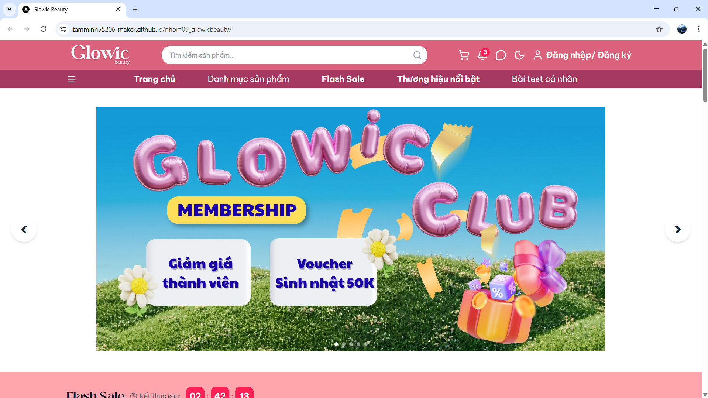
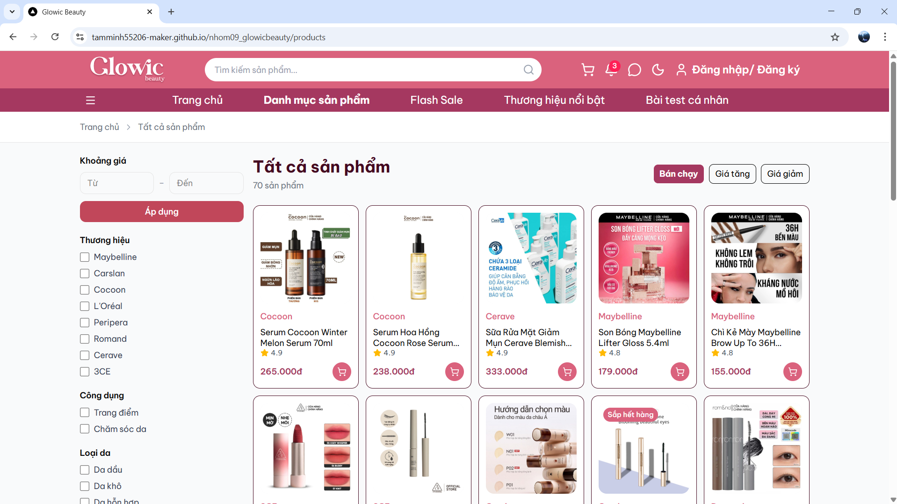
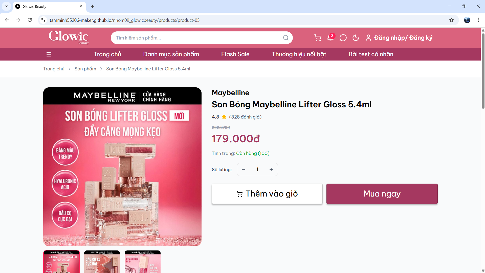
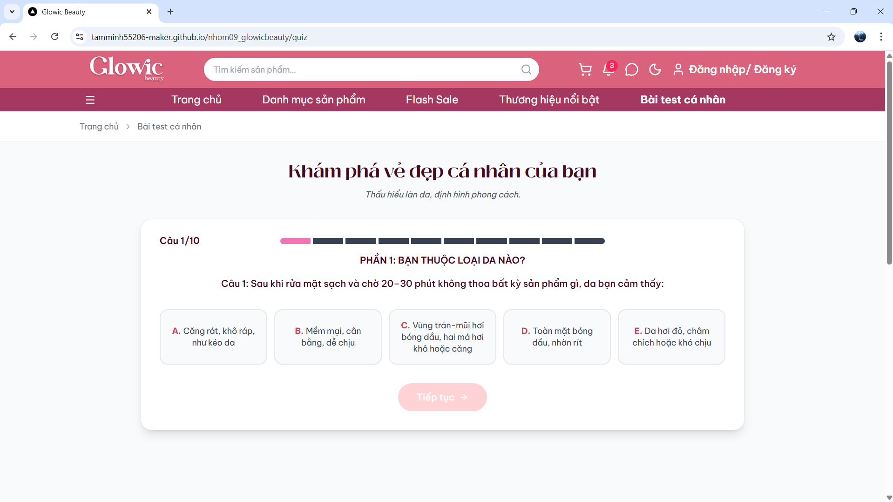
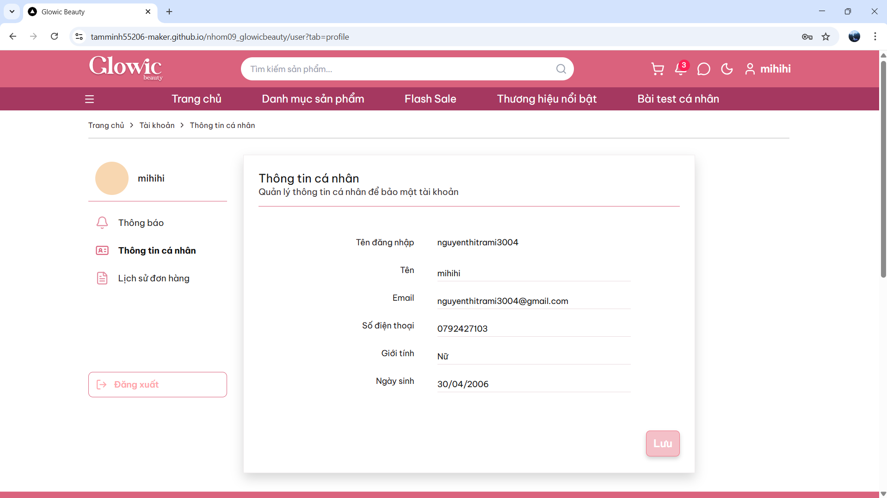

# ĐỒ ÁN CUỐI KÌ MÔN THIẾT KẾ WEB

## Nhóm 09 – Glowic Beauty


**Danh sách thành viên**

* Phạm Minh Tâm – MSSV: 24126201 – Nhóm trưởng
* Nguyễn Ái Quỳnh Anh – MSSV: 24125004 – Thành viên
* Huỳnh Thị Yến Nhi – MSSV: 24126162 – Thành viên
* Nguyễn Thị Trà Mi – MSSV: 24126131 – Thành viên
* Lương Thị Nguyệt – MSSV: 24126158 – Thành viên
* Đinh Nhật Huy – MSSV: 24126084 – Thành viên
* Bùi Khang Huy – MSSV: 24126083 – Thành viên

## Mô tả dự án

### Glowic Beauty – Website cửa hàng mỹ phẩm chính hãng

**Chủ đề**

Thiết kế và phát triển website thương mại điện tử chuyên về mỹ phẩm, hoạt động theo mô hình đại lý phân phối chính hãng các thương hiệu mỹ phẩm nổi tiếng.

**Thương hiệu**


Glowic Beauty là một nền tảng thương mại điện tử về mỹ phẩm được xây dựng với định hướng hiện đại, thân thiện và dễ sử dụng. Website hướng đến việc tạo ra một trải nghiệm mua sắm trực tuyến đơn giản nhưng hiệu quả, giúp người dùng dễ dàng tiếp cận các sản phẩm chăm sóc da và trang điểm chính hãng.

Điểm nổi bật của Glowic Beauty là khả năng hỗ trợ người dùng lựa chọn sản phẩm phù hợp dựa trên loại da và nhu cầu cá nhân thông qua bài test da. Ngoài ra, website còn tích hợp các tính năng như bộ lọc sản phẩm, Flash Sale, và gợi ý sản phẩm thông minh nhằm tối ưu trải nghiệm mua sắm.

## Một số tính năng nổi bật

* Bài test xác định loại da cá nhân hóa
  → hỗ trợ người dùng xác định loại da như da dầu, da khô, da hỗn hợp, da nhạy cảm,... và gợi ý sản phẩm phù hợp.

* Gợi ý sản phẩm theo kết quả bài test
  → tăng trải nghiệm mua sắm cá nhân hóa.

* Danh mục sản phẩm với bộ lọc chi tiết
  → lọc theo loại da, danh mục, thương hiệu, giá, sản phẩm bán chạy,...

* Flash Sale
  → hiển thị sản phẩm khuyến mãi cùng giá gốc,giá giảm và thời gian đếm ngược.

* Dark Mode / Light Mode
  → nâng cao trải nghiệm người dùng.

* Responsive đa thiết bị
  → tương thích tốt trên desktop, tablet và mobile.

* Lưu trữ User
  → lưu thông tin tài khoản và lịch sử đơn hàng, đảm bảo dữ liệu không bị mất khi đăng xuất và đăng nhập lại

* Trang FAQ hỗ trợ khách hàng
  → cải thiện trải nghiệm tư vấn và giải đáp.

## Các link sản phẩm

> Figma Design (Read Only): https://www.figma.com/design/ji70dE38hLWTwciEkBh5Na/Glowic-Beauty?node-id=0-1&t=sApx5IDvZjt0iKYB-1


> Link GitHub Pages: https://tamminh55206-maker.github.io/nhom09_glowicbeauty/

## Hướng dẫn chạy local

Mở Terminal tại thư mục muốn lưu dự án

1. Clone project

```bash
    git clone https://github.com/tamminh55206-maker/nhom09_glowicbeauty
```

2. Cài dependencies

```bash
    npm install
```

3. Chạy project local

```bash
    npm run dev
```

4. Truy cập website

* http://localhost:3000


## Giao diện một số trang chính trong Website


1. Trang chủ (Homepage)


 
---
2. Trang danh mục sản phẩm (Products Page)



---

3. Trang chi tiết sản phẩm (Product Detail) 



---

4. Trang bài test loại da (Skin Quiz)



---

5. Trang tài khoản người dùng (User)




